# Benchmark Architecture & GPU Allocation

Detailed explanation of how benchmarks work and how GPUs are allocated per model.

## Cluster Hardware

- 5x NVIDIA A40 48GB (240GB total VRAM)
- Configured in `configs/models.yaml` with `gpu_count: 5`

## System Architecture

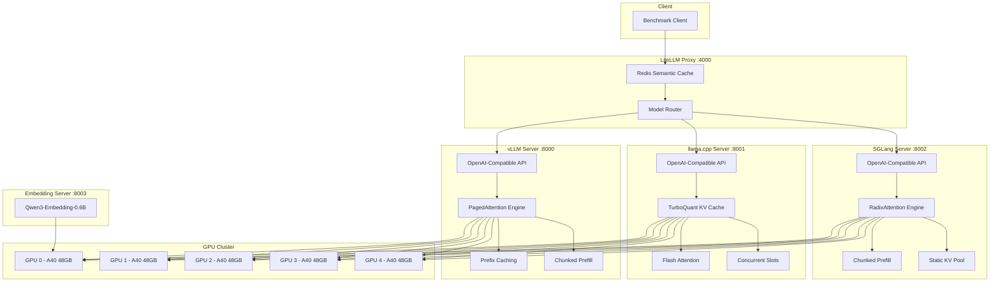

## Benchmark Orchestration Flow

The orchestrator (`scripts/bench-models.sh`) runs models **sequentially**, one at a time. Each model goes through: start server, benchmark, stop server, wait for GPU memory release, next model.

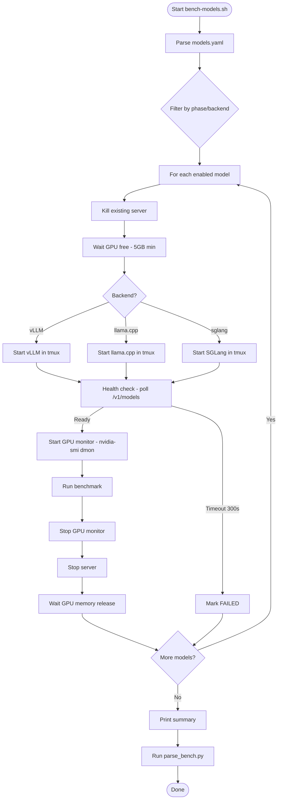

## vLLM: Tensor Parallelism (TP)

vLLM uses **tensor parallelism** to shard a single model across multiple GPUs. All GPUs work together on one instance — this is NOT multiple instances.

### How TP Works

The model's weight matrices are split along the hidden dimension. Each GPU holds a shard of the weights. During forward pass, each GPU processes its shard in parallel, then results are combined via all-reduce.

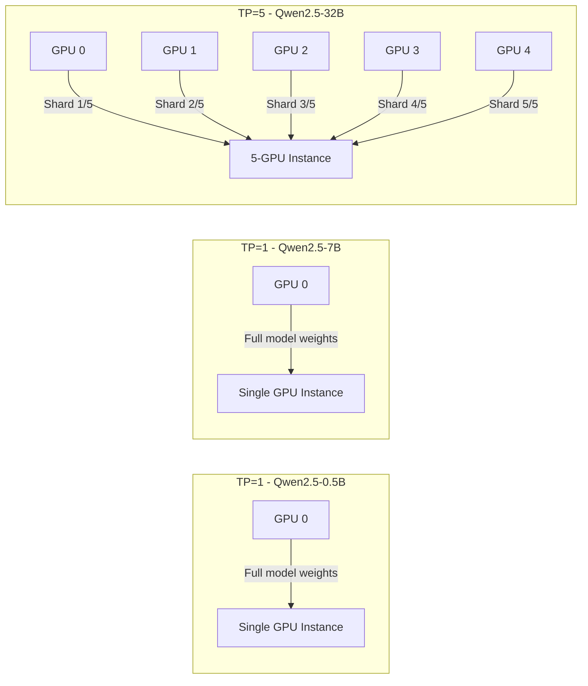

### Per-Model vLLM Configuration

| Model | Phase | TP | GPUs Used | Idle GPUs | Max Seqs | GPU Mem |
|-------|-------|-----|-----------|-----------|----------|---------|
| Qwen2.5-0.5B | P0 | 1 | GPU 0 only | GPUs 1-4 | 1536 | 0.75 |
| Qwen2.5-7B | P1 | 1 | GPU 0 only | GPUs 1-4 | 768 | 0.82 |
| Qwen2.5-14B | P2 | 2 | GPUs 0-1 | GPUs 2-4 | 256 | 0.85 |
| Qwen2.5-32B | P3 | 5 | All 5 GPUs | None | 192 | 0.82 |

### vLLM Startup Command

```
vllm serve <model_path> \
    --host 0.0.0.0 --port 8000 \
    --tensor-parallel-size <TP> \
    --gpu-memory-utilization <GPU_MEM> \
    --max-model-len 16384 \
    --max-num-seqs <MAX_SEQS> \
    --enable-prefix-caching \
    --enable-chunked-prefill \
    --max-num-batched-tokens 65536 \
    --block-size 16 \
    --distributed-executor-backend mp
```

Key flags:
- `--tensor-parallel-size`: Number of GPUs for tensor parallelism
- `--distributed-executor-backend mp`: Uses Python multiprocessing for TP coordination
- `--enable-prefix-caching`: Caches common prompt prefixes to avoid recomputation
- `--enable-chunked-prefill`: Splits long prompts into chunks for better latency

### vLLM GPU Memory Layout

For TP=5 (Qwen2.5-32B), each GPU holds:

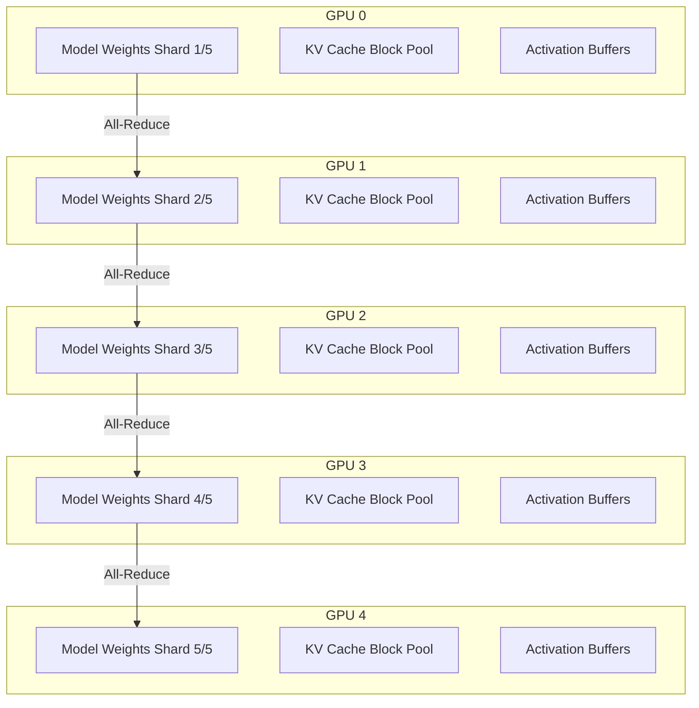

Memory breakdown (approximate for 32B model, 85% utilization on 5×48GB = 204GB total):
- Model weights: ~64GB (32B params * 2 bytes for fp16 / 5 GPUs)
- KV cache: ~130GB (distributed across block pools)
- Activations: ~10GB (temporary during forward pass)
- Reserved: ~0GB (headroom consumed by KV cache)

## llama.cpp: Tensor Split + Concurrent Slots

llama.cpp distributes model weights across GPUs using `tensor_split`, then runs multiple concurrent request slots (`n_parallel`) on top.

### How Tensor Split Works

Unlike vLLM's tensor parallelism (which splits matrix operations), llama.cpp's tensor split assigns different **layers** or **parts of layers** to different GPUs. The model runs as a single process, dispatching compute to the appropriate GPU for each layer.

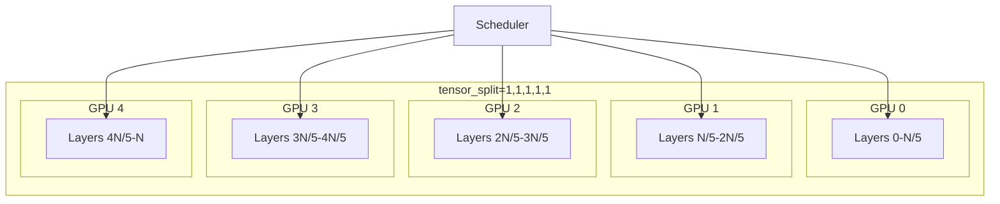

### Concurrent Slots (n_parallel)

`n_parallel` defines how many requests can be processed simultaneously. Each slot gets a share of the total context window.

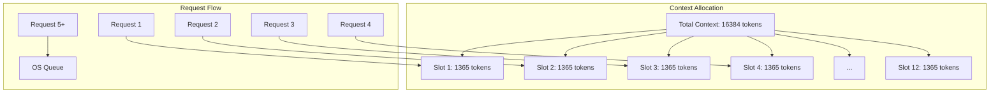

For the 32B model with `n_parallel=12`:
- Each slot gets `16384 / 12 = 1365 tokens` of context
- Requests beyond 12 queue in the OS until a slot frees up
- Stress tests cap at `n_parallel * 2` because beyond that, requests just queue

### Per-Model llama.cpp Configuration

| Model | Phase | tensor_split | n_parallel | Slot Context | Batch | UBatch |
|-------|-------|-------------|-----------|-------------|-------|--------|
| Qwen2.5-0.5B GGUF | P0 | 1,1,1,1,1 | 128 | 128 tokens | 8192 | 2048 |
| Qwen2.5-7B GGUF | P1 | 1,1,1,1,1 | 64 | 256 tokens | 8192 | 2048 |
| Qwen2.5-14B GGUF | P2 | 1,1,1,1,1 | 32 | 512 tokens | 8192 | 2048 |
| Qwen2.5-32B GGUF | P3 | 1,1,1,1,1 | 12 | 1365 tokens | 8192 | 2048 |

### llama.cpp Startup Command

```
llama-server \
    -m <model.gguf> \
    --host 0.0.0.0 --port 8001 \
    -np <N_PARALLEL> \
    -c 16384 \
    -ngl 999 \
    -b 8192 -ub 2048 \
    -t 48 \
    -ctk q8_0 -ctv turbo4 \
    -fa on \
    --cache-prompt \
    --tensor-split "1,1,1,1,1" \
    --metrics
```

Key flags:
- `-np`: Number of concurrent slots
- `-ctv turbo4`: TurboQuant 4-bit value KV cache (~50% VRAM savings)
- `-ctk q8_0`: Standard 8-bit key cache
- `--tensor-split`: GPU weight distribution
- `-fa on`: Flash Attention for faster attention computation
- `--cache-prompt`: Cache prompt computations for repeated prefixes

### llama.cpp KV Cache with TurboQuant

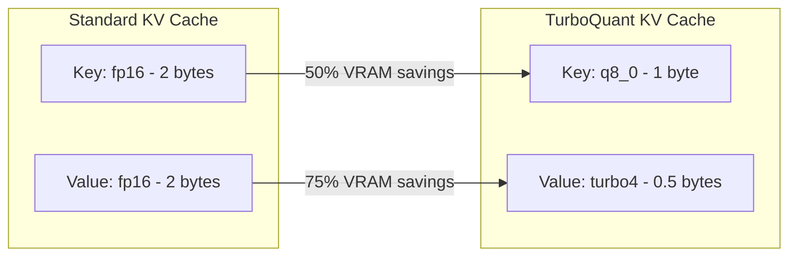

For 32B model at 16K context, 12 slots:
- Standard: ~48GB for KV cache
- TurboQuant: ~16GB for KV cache (67% savings)

## SGLang: RadixAttention + Tensor Parallelism

SGLang uses **RadixAttention** (a prefix-tree KV cache shared across requests) combined with tensor parallelism for multi-GPU sharding. It is the third engine in the project and the only one with built-in prefix-tree KV reuse.

### How SGLang Differs from vLLM and llama.cpp

| Aspect | SGLang | vLLM | llama.cpp |
|--------|--------|------|-----------|
| KV cache structure | RadixAttention (prefix tree) | PagedAttention (block pool) | Contiguous per-slot buffer |
| Prefix sharing | Native (across requests) | Enabled via `--enable-prefix-caching` | `--cache-prompt` (per slot) |
| Continuous batching | Yes | Yes | Yes |
| Chunked prefill | Yes | Yes | No |
| Speculative decoding | EAGLE / ngram / draft | Draft model | Draft model + ngram |
| Attention backends | FlashInfer, FlashAttention, Triton | FlashInfer, FlashAttention, XFormers | Custom (llama.cpp) |
| LoRA | Runtime | Runtime | Static load |
| Multimodal | Native | Native | Via mmproj |

### How RadixAttention Works

Unlike vLLM's per-request block pool, SGLang maintains a **radix tree** of KV cache entries. When multiple requests share a common prefix (system prompt, few-shot examples), the tree is traversed and only the diverging suffix is computed. This is the same physical operation as prefix caching, but the radix tree data structure enables much cheaper cache lookup and eviction.

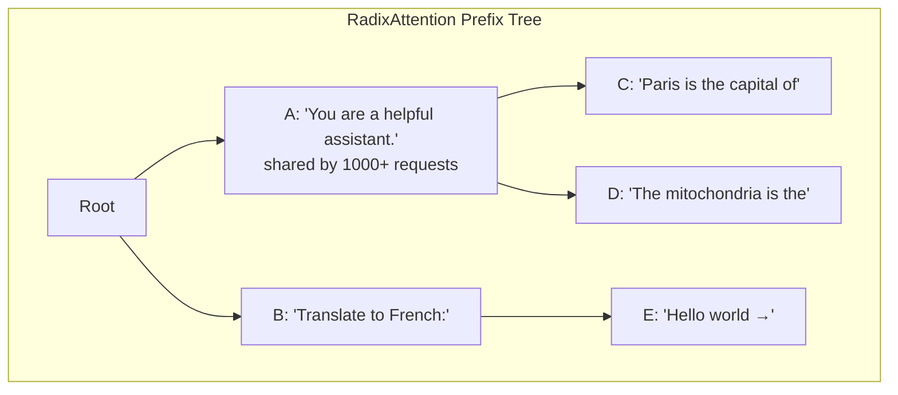

When a new request arrives, SGLang walks the radix tree matching token IDs. Cached KV blocks are reused; only new suffix tokens are computed. After the request finishes, the tree is updated.

### Per-Model SGLang Configuration

Currently only P0 (0.5B) and P1 (7B) are configured for SGLang. Larger SGLang models would follow the same TP pattern as vLLM but are not yet in `configs/models.yaml`.

| Model | Phase | TP | GPUs Used | Idle GPUs | Mem Fraction | Max Context |
|-------|-------|-----|-----------|-----------|--------------|-------------|
| Qwen2.5-0.5B (SGLang) | P0 | 1 | GPU 0 | GPUs 1-4 | 0.75 | 16384 |
| Qwen2.5-7B (SGLang) | P1 | 1 | GPU 0 | GPUs 1-4 | 0.82 | 16384 |

### SGLang Startup Command

```bash
/opt/venv-sglang/bin/python -m sglang.launch_server \
    --model <model_path> \
    --host 0.0.0.0 --port 8002 \
    --tp-size <TP> \
    --mem-fraction-static <MEM_FRAC> \
    --context-length 16384 \
    --max-running-requests 2048 \
    --max-queued-requests 4096 \
    --trust-remote-code \
    --disable-radix-cache
```

Key flags:
- `--tp-size`: Number of GPUs for tensor parallelism
- `--mem-fraction-static`: Fraction of GPU VRAM reserved for KV cache (SGLang uses static allocation, unlike vLLM's PagedAttention)
- `--max-running-requests`: Maximum concurrent in-flight requests (similar to vLLM's `--max-num-seqs`)
- `--max-queued-requests`: Queue depth for requests waiting for a free slot
- `--disable-radix-cache`: Disables RadixAttention (used when benchmarking the non-cached baseline)
- `--attention-backend`: Attention implementation — `flashinfer` (default), `flashattention`, `triton`

### SGLang GPU Memory Layout

For Qwen2.5-7B (SGLang) on GPU 0, single-GPU TP=1 with 0.82 mem fraction (~39GB usable on a 48GB A40):

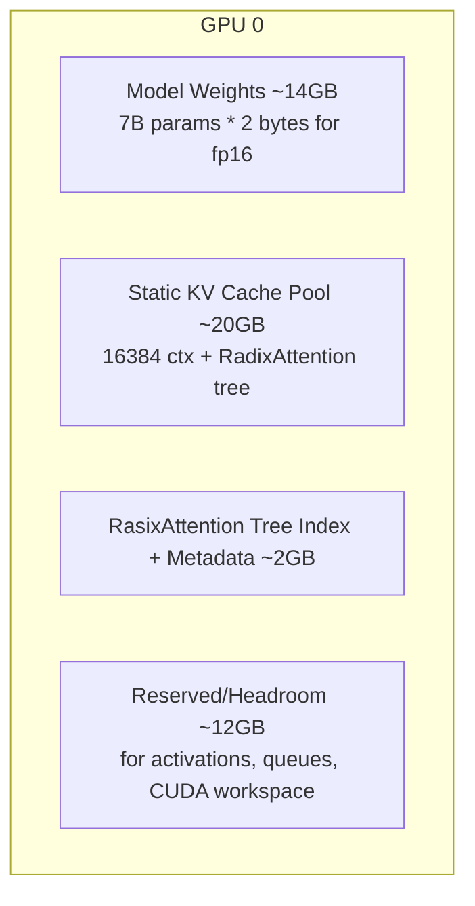

Memory breakdown for 7B SGLang at TP=1 (rough estimates, SGLang uses static allocation):
- Model weights: ~14GB (7B params * 2 bytes for fp16)
- Static KV cache pool: ~20GB (fixed allocation, grows with `--context-length`)
- RadixAttention tree index + metadata: ~2GB (per-token positions, ref counts)
- Reserved/headroom: ~12GB (activations, queued requests, CUDA workspace)

Note: these are illustrative. SGLang uses static memory allocation (unlike vLLM's PagedAttention), so the KV pool size is determined by `--mem-fraction-static` × total VRAM and `--context-length` × `--max-running-requests`. RadixAttention reuses cached prefix KV across requests, reducing effective per-request VRAM cost for workloads with high prefix overlap.

### SGLang KV Cache with RadixAttention

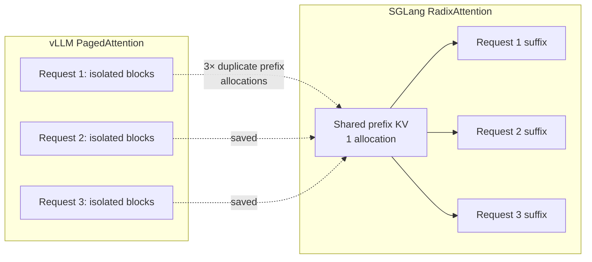

For workloads with high prefix overlap (system prompts, few-shot examples, agent loops), RadixAttention reduces KV cache VRAM usage by 30-60% compared to isolated per-request blocks.

## GPU Allocation During Benchmarks

### Sequential Execution

Only **one model runs at a time**. The orchestrator cycles through all enabled models, alternating vLLM and llama.cpp per model (not running both backends simultaneously for the same model). Total wall time scales with the number of enabled models and the per-model benchmark duration — there is no fixed timeline.

### GPU Utilization Per Phase

Only one engine runs at a time per model. vLLM, SGLang, and llama.cpp all use the full 5-GPU cluster when configured for TP>1, but with different sharding semantics.

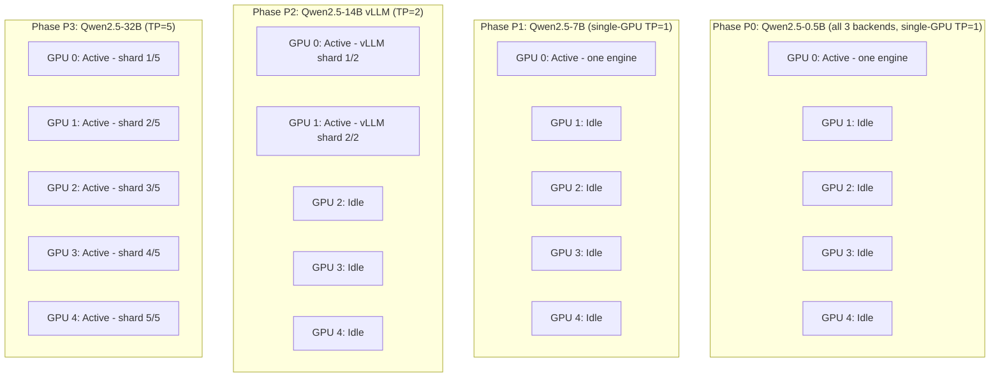

### GPU Memory Release Between Models

After each model benchmark, the orchestrator:

1. Kills the server process (tmux session + process tree)
2. Runs `wait_gpu_free` — polls `nvidia-smi` until at least 5GB VRAM is free on all GPUs
3. Timeout after 60 seconds (proceeds anyway with warning)

This ensures no GPU memory leaks between model runs.

## Benchmark Execution Flow

### vLLM Benchmark Phases

```mermaid
flowchart LR
    subgraph "Phase P0: Smoke"
        P0C1[Conc 1]
        P0C4[Conc 4]
    end

    subgraph "Phase P1: Light"
        P1C1[Conc 1]
        P1C32[Conc 32]
        P1C64[Conc 64]
        P1C128[Conc 128]
    end

    subgraph "Phase P2: Medium"
        P2C1[Conc 1]
        P2C16[Conc 16]
        P2C32[Conc 32]
        P2C64[Conc 64]
    end

    subgraph "Phase P3: Heavy"
        P3C1[Conc 1]
        P3C4[Conc 4]
        P3C8[Conc 8]
        P3C16[Conc 16]
    end

    P0C1 --> P0C4 --> P1C1 --> P1C32 --> P1C64 --> P1C128
    P1C128 --> P2C1 --> P2C16 --> P2C32 --> P2C64
    P2C64 --> P3C1 --> P3C4 --> P3C8 --> P3C16
```

Each concurrency level runs `vllm bench serve` with:
- `num_prompts = min(concurrency * 8, max_seqs)`
- `request-rate inf` (as fast as possible)
- Metrics: TTFT, TPOT, ITL, E2E latency

### llama.cpp Benchmark Tests

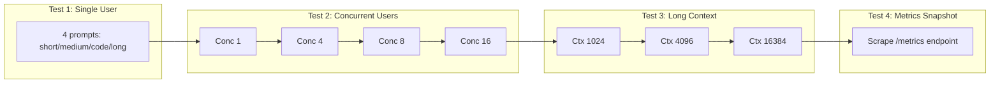

Concurrency is capped at `n_parallel` — beyond that, requests queue in the OS and don't measure real throughput.

### Stress Test (Incremental Concurrency)

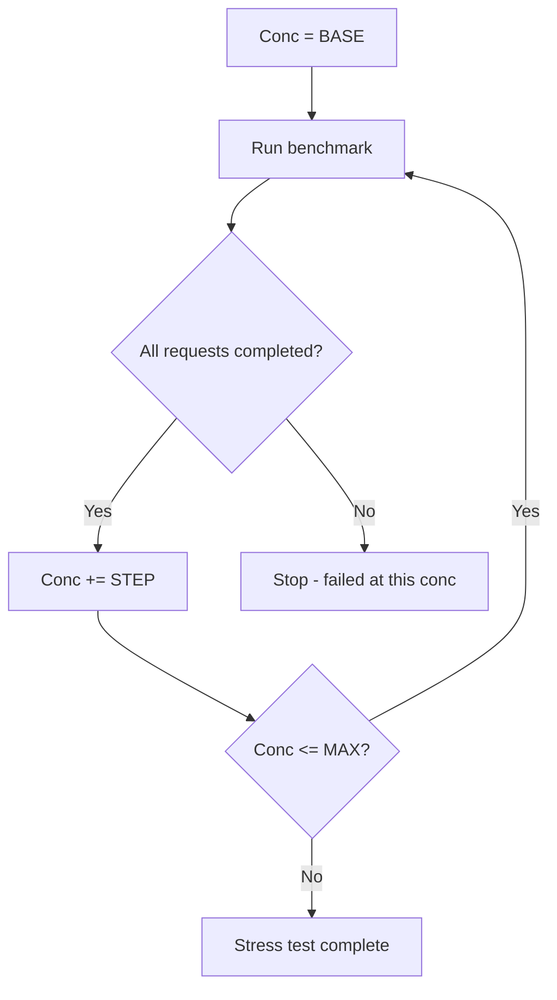

vLLM stress: 1 → 100 → 200 → ... → 2000 (step 100)
llama.cpp stress: 1 → 5 → 9 → ... → 64 (step 4, capped at n_parallel * 2)

## Results Structure

Per-run results are written under `results/<backend>/<session>/` by each benchmark script. After the orchestrator finishes, run `parse_bench.py` to aggregate them.

For the parser's output format (`_summary.csv`, `_report.tsv`, `_table.md`), see [benchmark-guide.md](benchmark-guide.md#5-convert-to-summary-table--png-visualization).

## Key Metrics Collected

### vLLM Metrics

| Metric | Description |
|--------|-------------|
| TTFT (Time to First Token) | Latency from request to first generated token |
| TPOT (Time Per Output Token) | Average time between consecutive tokens |
| ITL (Inter-Token Latency) | Latency between tokens (jitter) |
| E2EL (End-to-End Latency) | Total request latency |
| Request Throughput | Requests completed per second |
| Output Throughput | Tokens generated per second |

### llama.cpp Metrics

| Metric | Description |
|--------|-------------|
| Prompt Tokens | Number of input tokens |
| Completion Tokens | Number of generated tokens |
| Decode TPS | Tokens per second during generation |
| Prefill TPS | Tokens per second during prompt processing |
| Slots Idle/Processing | Concurrent slot utilization |
| KV Cache Usage | Percentage of KV cache blocks in use |

### SGLang Metrics

| Metric | Description |
|--------|-------------|
| TTFT (Time to First Token) | Latency from request to first generated token (prefill latency) |
| TPOT (Time Per Output Token) | Average time between consecutive tokens |
| ITL (Inter-Token Latency) | Latency between tokens (jitter) |
| Request Throughput | Requests completed per second |
| Output Throughput | Tokens generated per second |
| RadixAttention Hit Rate | Percentage of prompt prefix tokens served from cached KV blocks |
| KV Cache Pool Usage | Percentage of static KV pool currently allocated |
| Queued Requests | Number of requests waiting for a free slot |

## Configuration Reference

### models.yaml Cluster Defaults

```yaml
cluster:
  gpu_count: 5
  vllm:
    tp: 5
    gpu_mem_util: "0.85"
    max_model_len: 16384
    max_num_seqs: 1024
    max_batched_tokens: 65536
    block_size: 16
    swap_space: 64
    distributed_executor: mp
  llamacpp:
    n_parallel: 48
    ctx_size: 16384
    tensor_split: "1,1,1,1,1"
    batch: 8192
    ubatch: 2048
    threads: 48
    cache_key: q8_0
    cache_val: turbo4
  sglang:
    mem_fraction: "0.85"
    max_model_len: 4096
```

### Per-Model Overrides

Each model in the `models:` list can override cluster defaults:
- vLLM: `vllm_tp`, `vllm_gpu_mem`, `vllm_max_seqs`, `vllm_max_model_len`, etc.
- llama.cpp: `llamacpp_n_parallel`, `llamacpp_tensor_split`, `llamacpp_ctx_size`, etc.
- SGLang: `sglang_mem_fraction`, `sglang_max_model_len`.

Models requiring more GPUs than `gpu_count` are auto-skipped with `SKIP:tp>N`.
